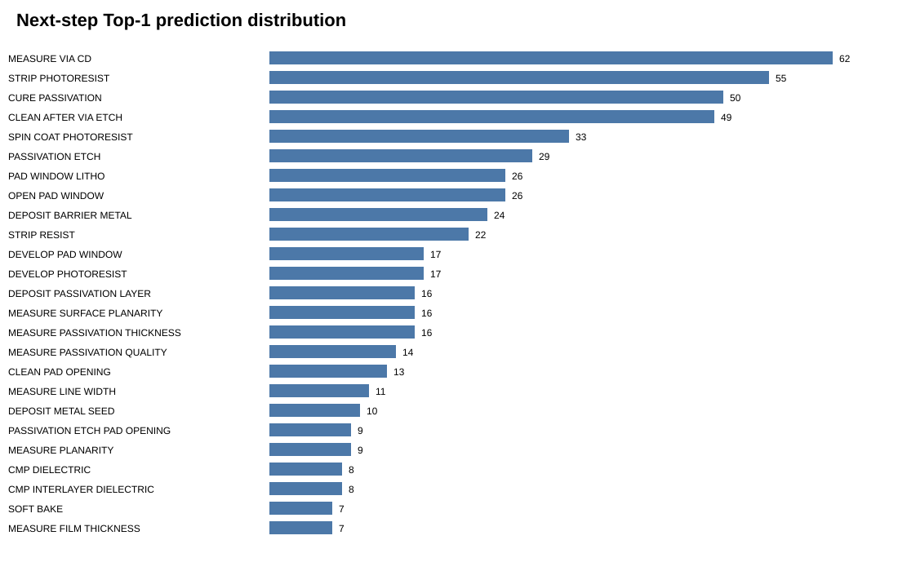
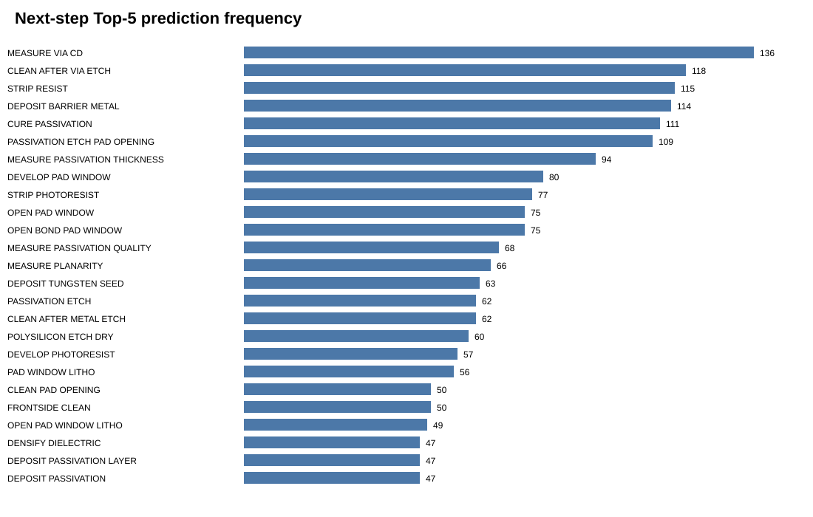
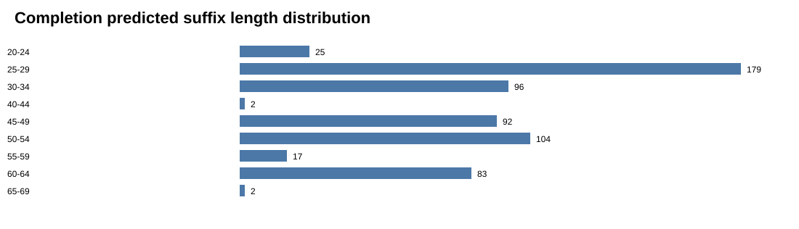
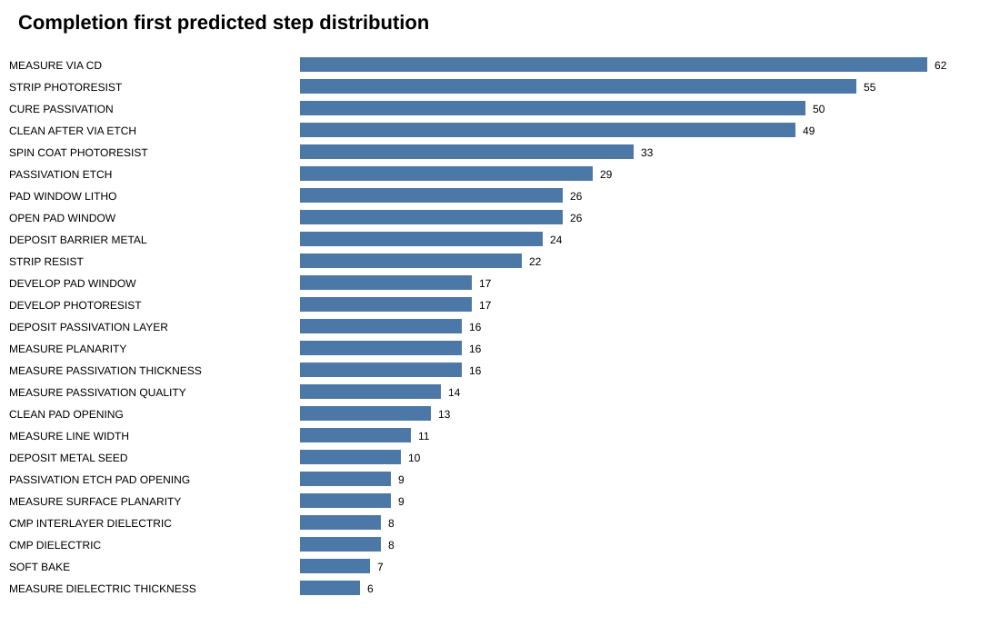
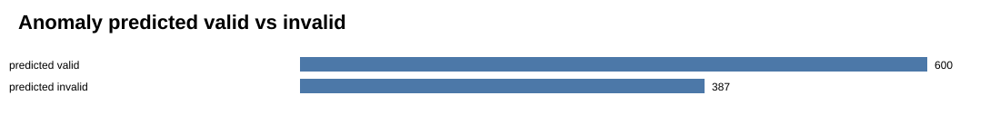
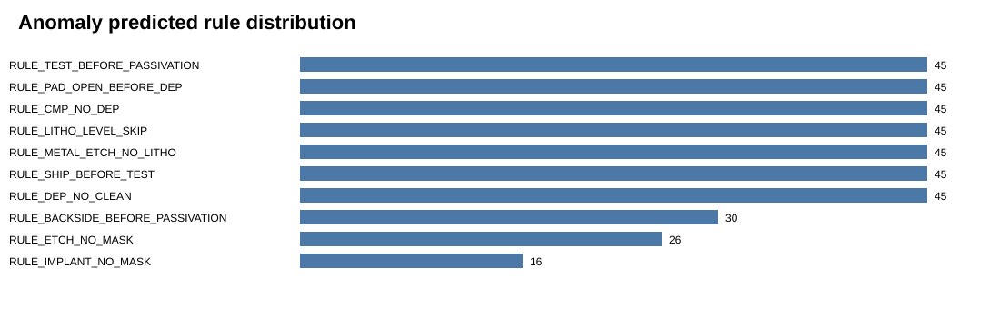
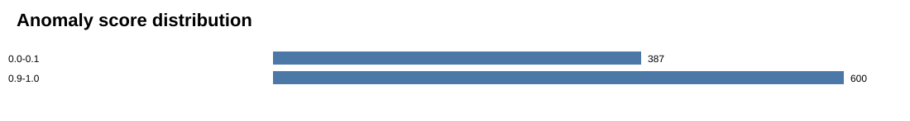

# Eval Prediction Diagnostics

The organizer eval inputs are unlabeled, so this report does **not** show official accuracy or F1. It only checks and visualizes our generated prediction files.

## File Counts

| File | Rows including header |
| --- | --- |
| eval_input_valid.csv | 601 |
| predictions_nextstep.csv | 601 |
| predictions_completion.csv | 601 |
| eval_input_anomaly.csv | 988 |
| predictions_anomaly.csv | 988 |

## Next-step Predictions

| Metric | Value |
| --- | --- |
| Examples | 600 |
| Unique Top-1 predicted steps | 41 |
| Unique steps appearing in Top-5 | 124 |

## Sequence Completion

| Metric | Value |
| --- | --- |
| Examples | 600 |
| Mean predicted suffix length | 40.50 |
| Min predicted suffix length | 21 |
| Max predicted suffix length | 66 |

## Anomaly Predictions

| Metric | Value |
| --- | --- |
| Examples | 987 |
| Predicted valid | 600 |
| Predicted invalid | 387 |
| Unique predicted violation rules | 10 |

## Interpretation

- Matching row counts mean the prediction files are structurally complete.

- The plots show prediction distributions, not official accuracy.

- Official scores require the hidden organizer ground truth.

- The anomaly predictions are validator-based, so they reflect whether the explicit 10 process rules flag a sequence as invalid.