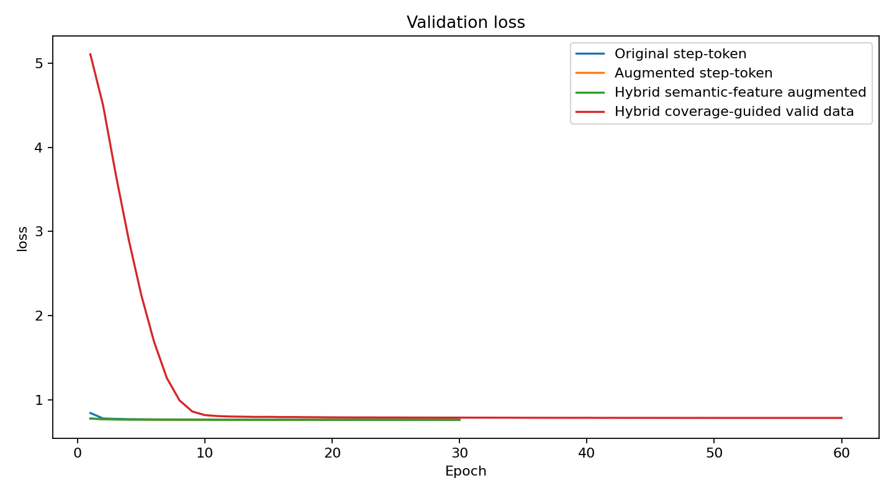
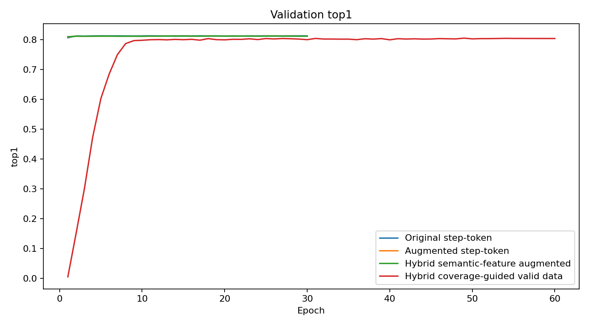
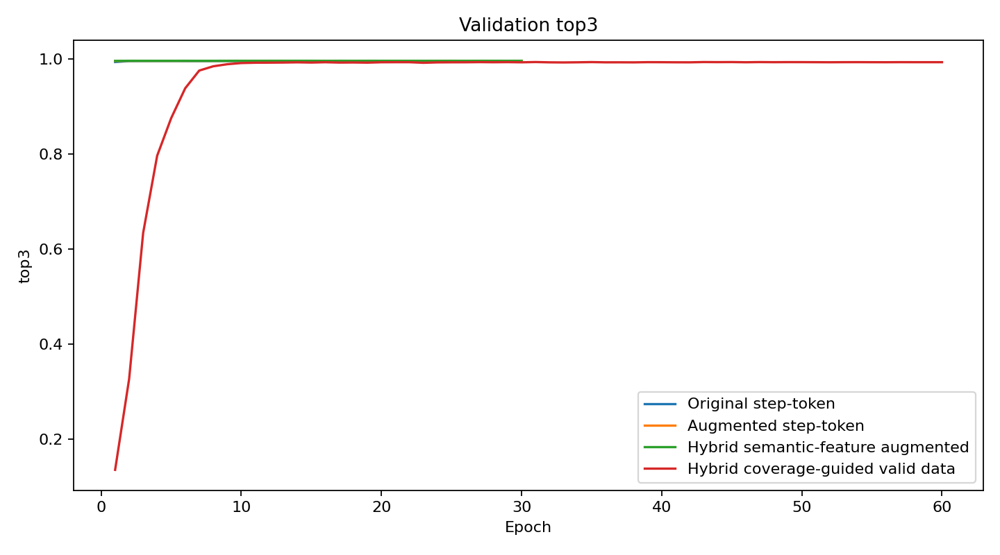
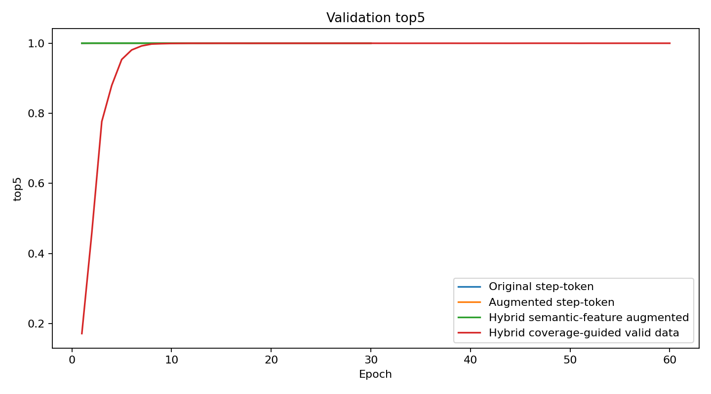
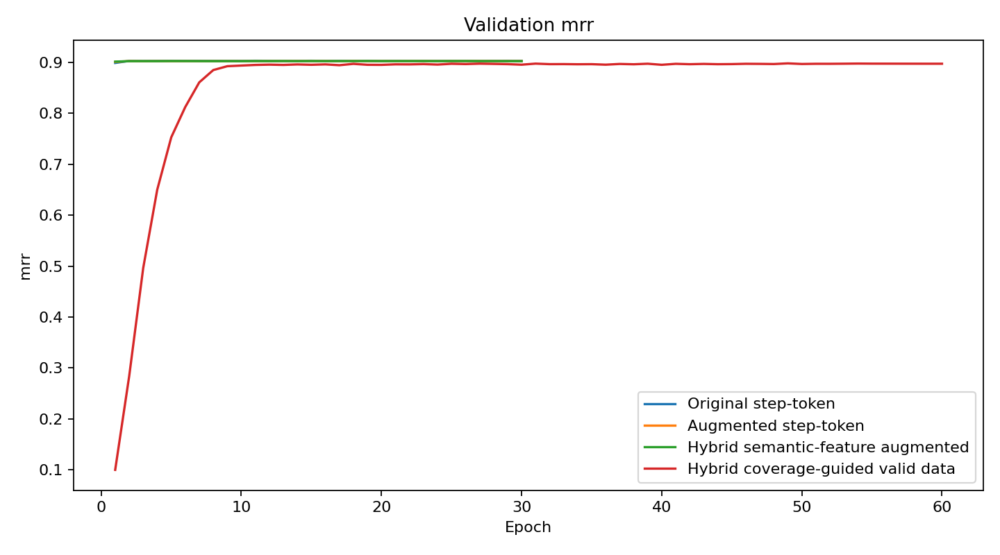
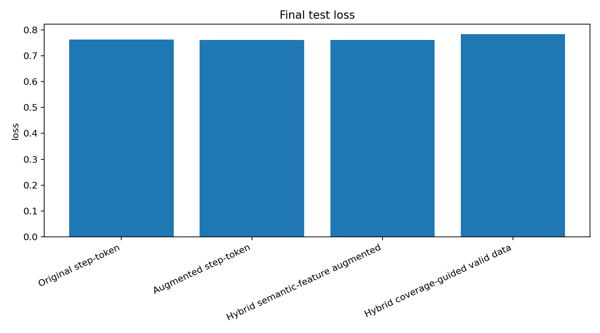
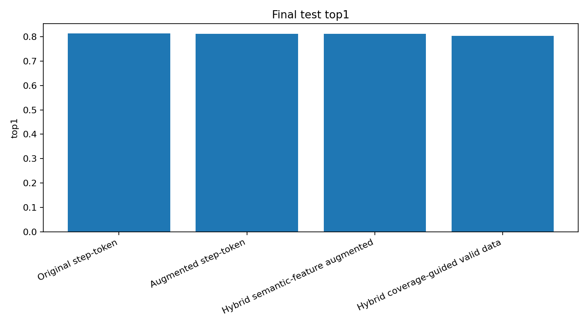
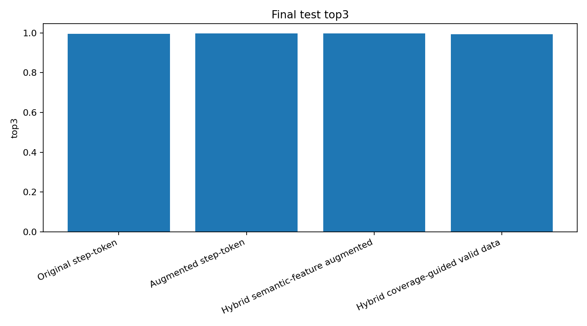
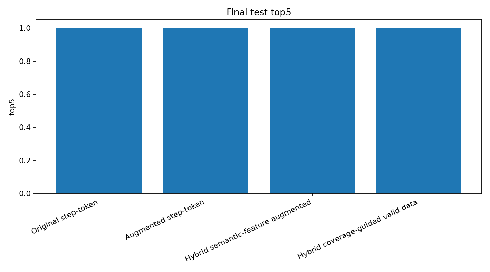

<!-- BEGIN_COVERAGE_GUIDED_RESULTS -->

---

## Coverage-Guided Data Run

We added a fourth SSL run trained on the new coverage-guided valid semiconductor process dataset.

### Updated Final Test Metrics

| Model | Test loss | Top-1 | Top-3 | Top-5 | MRR |
|---|---:|---:|---:|---:|---:|
| Original step-token | 0.7631 | 0.8125 | 0.9955 | 0.9999 | 0.9034 |
| Augmented step-token | 0.7606 | 0.8117 | 0.9960 | 1.0000 | 0.9029 |
| Hybrid semantic-feature augmented | 0.7607 | 0.8116 | 0.9960 | 1.0000 | 0.9029 |
| Hybrid coverage-guided valid data | 0.7829 | 0.8031 | 0.9932 | 0.9997 | 0.8976 |

### Interpretation

The new coverage-guided run reaches **Top-1 0.8031**, **Top-3 0.9932**, **Top-5 0.9997**, and **MRR 0.8976** on the held-out test split. It remains very strong on in-distribution next-step prediction. Compared with the previous SSL runs, it is slightly lower on exact Top-1/Top-3, which is consistent with the coverage-guided dataset being more diverse and harder, rather than simply larger.

The important conclusion is not that the new run is the absolute winner on in-distribution next-step prediction. The stronger result is that the new data pipeline creates a broader, coverage-guided valid-process benchmark while the hybrid model still reaches near-saturated Top-3/Top-5 performance.

The next meaningful evaluation is no longer plain in-distribution next-step prediction, but:

- anomaly detection on easy and hard invalid sequences,
- rule-violation attribution,
- OOD or held-out-branch generalization,
- error-driven regeneration around model failure modes.

### New Figures

Validation curves:

| | |
|---|---|
|  |  |
|  |  |

Final test bar charts:

| | |
|---|---|
|  |  |
|  |  |

<!-- END_COVERAGE_GUIDED_RESULTS -->
