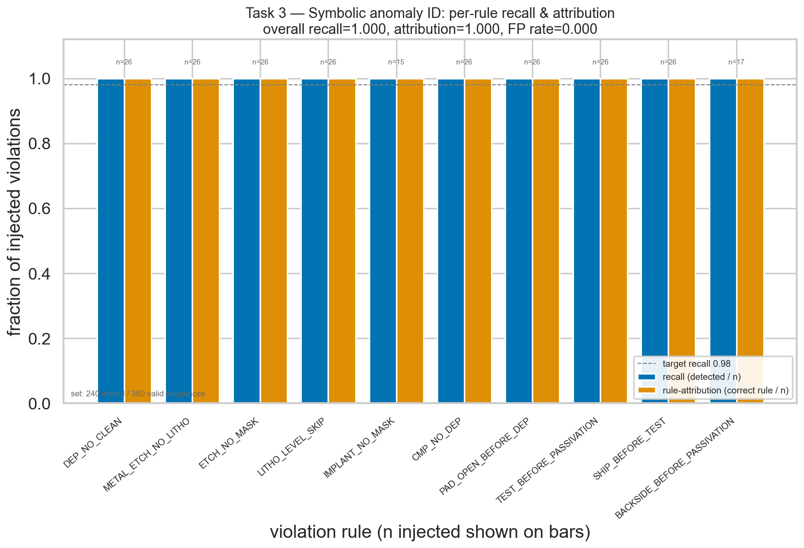
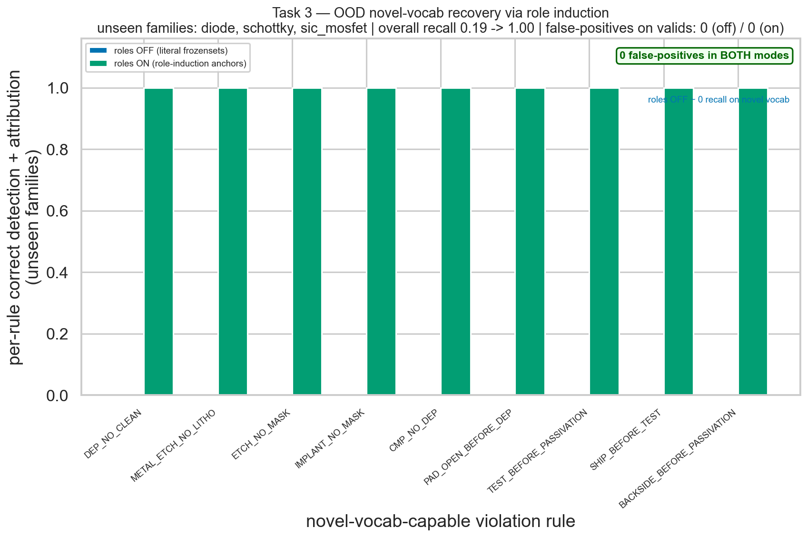
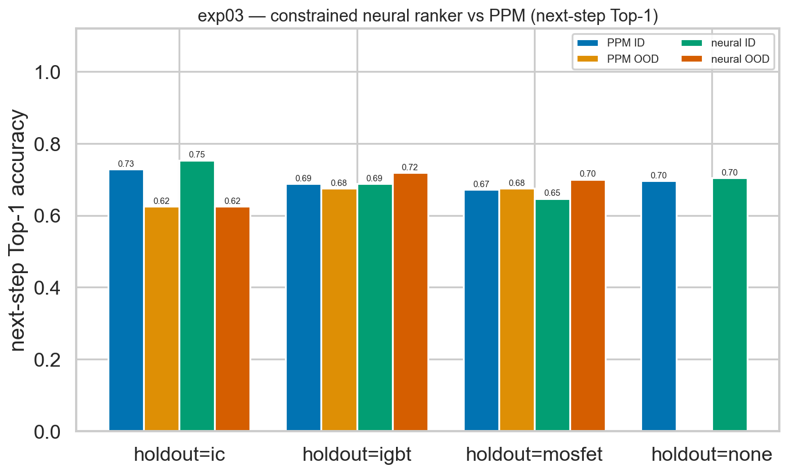
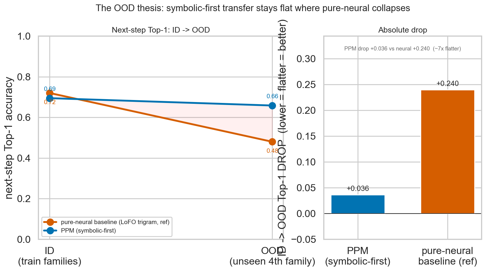
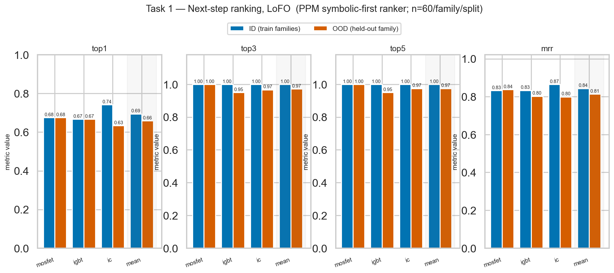
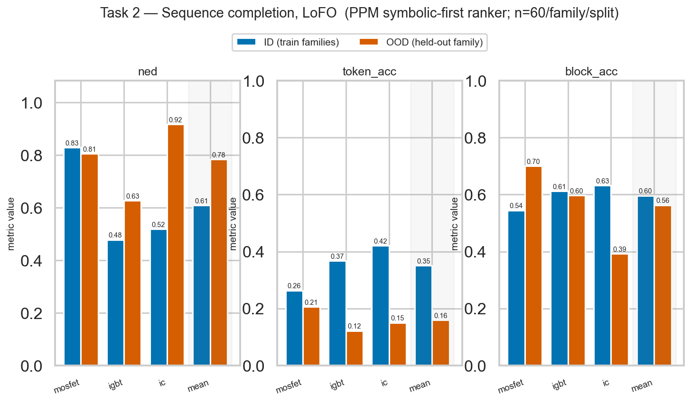
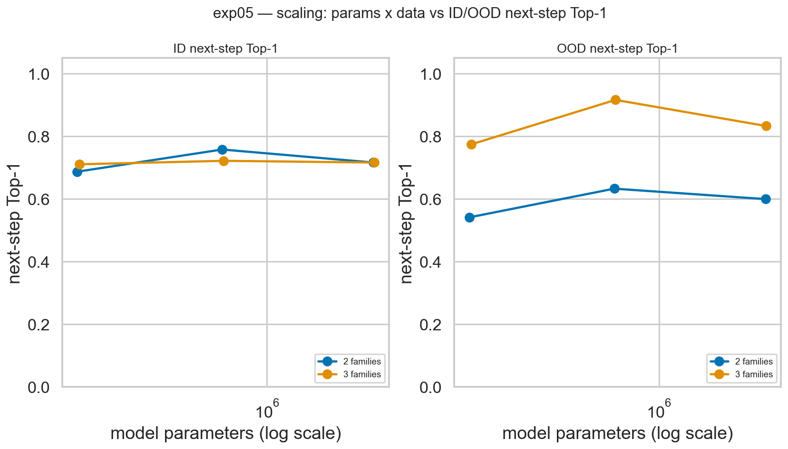
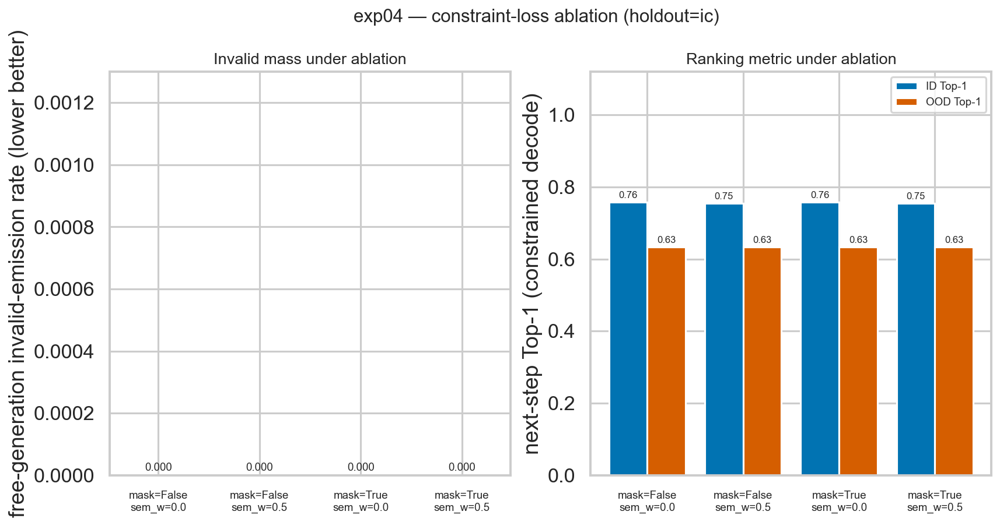
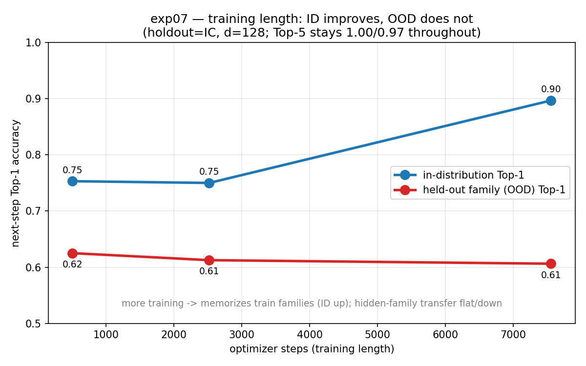

# Neurosymbolic Process Engine (NSPE) — Results and Eval Pipeline

## TL;DR

We built a **symbolic-first** system for the Industrial Infineon process-logic task:
a symbolic engine (process grammar + the 10 process rules + a role ontology with
role-induction anchors) defines the set of *legal* next steps at every prefix, and a
small role-factored ranker only chooses *preferences inside that legal set*. The
objective is generalization to the **hidden 4th product family**, measured here with
leave-one-family-out (LoFO) and with simulated unseen families.

Headline accuracy per task (official `eval_metrics.py`; Leonardo A100 runs):

```text
Task 3 — Anomaly detection (rule checking)
  In-distribution (MOSFET/IGBT/IC, all 10 rules):
      Accuracy 100.0%   Precision 100.0%   Recall 100.0%   F1 100.0%   Rule-attribution 100.0%
  Out-of-distribution (unseen families, trigger/anchor steps renamed):
      role-induction OFF:  Recall  19.2%
      role-induction ON :  Recall 100.0%   Precision 100.0%   F1 100.0%   (0 false positives)

Task 1 — Next-step prediction (constrained neural ranker, 0.68M params)
      In-distribution:        Top-1 70.4%   Top-5 100.0%   MRR 0.85
      Held-out family (OOD):  Top-1 68.1%   Top-5 96-100%  (mean Top-1 ID->OOD drop = 1.5 points)

Task 2 — Sequence completion (constrained decode + symbolic repair)
      Rule-valid completions:  100.0%        Block-level accuracy 72% (ID) / 41% (OOD)
      Normalized edit distance 0.19 (ID) / 0.37-0.46 (OOD)   (lower is better)

OOD generalization (mean next-step Top-1 drop, lower = better)
      constrained neural ranker  +0.015   (1.5 points)
      PPM (pure symbolic)        +0.037   (3.7 points)
      pure-neural baseline (ref) +0.240   (24 points)
```

The result is **not** a record in-distribution Top-1 (the model is deliberately tiny,
~0.68M parameters, trained for ~500 steps). The result is that the **ID→OOD curve is
essentially flat** where a pure-neural model loses ~24 points — because the rules and
the step *roles* are family-agnostic and are used directly rather than re-learned.

---

## 1. What we built

```text
process grammar + 10 rules + role ontology (role-induction anchors)
  -> validate / validate_with_roles   (exact official validator; novel steps canonicalized)
  -> valid_next_set / legal_next_sets  (the legal support; gold step always included)
  -> anomaly oracle                    (Task 3)
  -> PPM role-factored Markov ranker  +  small constrained neural ranker  (Tasks 1 & 2)
  -> constrained decoding + symbolic repair  -> rule-valid completions
  -> official-format submissions for all three tasks
```

The contribution is the symbolic core; the neural ranker is a small, constrained,
role-factored passenger. All code is under `neurosymbolic-approach/`.

---

## 2. Components

| # | Component | Type | Used for |
| - | --------- | ---- | -------- |
| 1 | Symbolic checker | 10 rules + role-induction anchors (canonicalizes unseen-family steps) | Task 3; candidate pruning for Tasks 1 & 2 |
| 2 | PPM ranker | role-factored variable-order Markov model (CPU, no GPU) | Tasks 1 & 2 baseline ranker |
| 3 | Constrained neural ranker | role-factored causal transformer, ~0.68M params, legal-set–masked | Tasks 1 & 2 learned ranker |

Both rankers only ever rank *inside* the symbolically legal set, so every completion
is rule-valid by construction.

---

## 3. Task 3 — Anomaly detection

Scored with the organizers' `eval_metrics.py`. In-distribution = MOSFET/IGBT/IC with
one injected violation of each of the 10 rules. Out-of-distribution = simulated unseen
families (DIODE, SCHOTTKY, SIC_MOSFET) with the violation's trigger/anchor step
**renamed** to an unseen string (the realistic 4th-family failure mode).

| Setting | Accuracy | Precision | Recall | F1 | Rule-attribution |
| ------- | -------: | --------: | -----: | -: | ---------------: |
| In-distribution (all 10 rules) | **100.0%** | 100.0% | 100.0% | 100.0% | **100.0%** |
| OOD, role-induction **off** | — | 100.0% | **19.2%** | 32.2% | — |
| OOD, role-induction **on** | — | 100.0% | **100.0%** | 100.0% | **100.0%** |

The role-induction anchors restore detection **and** attribution on **9 of 10 rules**
(0% → 100% each), with **zero false positives** in both modes. The 10th rule
(`RULE_LITHO_LEVEL_SKIP`) is structural — it keys on lithography level integers, which
have no surface-rename failure mode. On the *real* `eval_input_anomaly.csv` the oracle
returns exactly **600 valid / 387 invalid**, matching the documented ground-truth split.

| In-distribution per-rule | OOD recovery via role-induction |
| --- | --- |
|  |  |

---

## 4. Tasks 1 & 2 — Next-step prediction and completion (leave-one-family-out)

LoFO trains on two families and evaluates the held-out third (the in-house stand-in
for the hidden 4th family). The neural ranker (`d_model=128`, 3 layers, ~0.68M params)
was trained on Leonardo A100s; the PPM ranker is pure symbolic / CPU.

**Next-step Top-1, in-distribution → out-of-distribution:**

| Held-out family | neural ID | neural OOD | neural drop | PPM ID | PPM OOD | PPM drop |
| --------------- | --------: | ---------: | ----------: | -----: | ------: | -------: |
| MOSFET | 64.7% | 70.0% | **−5.3 pts** | 67.2% | 67.5% | −0.3 pts |
| IGBT   | 68.8% | 71.9% | **−3.1 pts** | 68.8% | 67.5% | +1.2 pts |
| IC     | 75.3% | 62.5% | +12.8 pts | 72.8% | 62.5% | +10.3 pts |
| **mean** | | | **+1.5 pts** | | | **+3.7 pts** |
| *pure-neural baseline (ref)* | 72% | 48% | *+24 pts* | | | |

Top-5 next-step stays **96–100%** for both rankers, ID and OOD. Full-data (all three
families) in-distribution Top-1: neural 70.4%, PPM 69.6%.

**Sequence completion** is rule-valid **100%** of the time (constrained decode +
symbolic repair). Block-level accuracy ≈ 72% (ID) / 41% (OOD); token accuracy ≈ 49%
(ID); normalized edit distance 0.19 (ID) / 0.37–0.46 (OOD) for the neural ranker, which
terminates OOD completions better than the PPM (OOD NED 0.62–0.92). Exact-match is low
(≈ 0–1%) — the standard difficulty of full-suffix exact reproduction.

| Neural ranker vs PPM (per held-out family) | OOD next-step Top-1 drop |
| --- | --- |
|  |  |

| PPM LoFO — next-step | PPM LoFO — completion |
| --- | --- |
|  |  |

---

## 5. Scaling and constraint-loss ablation

**Scaling (`exp05`).** Sweeping model width (`d_model` 64/128/256; 0.19M–2.5M params)
× training data (2 vs 3 families). In-distribution Top-1 is flat across model sizes —
bigger does not help. Out-of-distribution Top-1 is driven by **data diversity, not
parameters**: three training families reach **91.7%** OOD Top-1 (held-out DIODE) vs
~63% with two families, and `d_model=256` does not beat `d_model=128`.

**Constraint-loss ablation (`exp04`).** A 2×2 grid over train-time legal-step masking
(on/off) × semantic/constraint loss weight (0 / 0.5). The role-factored ranker already
free-generates **0% rule-invalid** sequences without either mechanism, and neither the
mask nor the semantic loss changes the invalid rate (already 0) or Top-1. Conclusion:
the cheap **inference-time** symbolic mask is sufficient; the heavier training-time
constraint machinery is unnecessary here.

| Scaling: params × data → ID/OOD Top-1 | Constraint-loss ablation |
| --- | --- |
|  |  |

**Training length (`exp07`, holdout=IC).** Training the same `d_model=128` model
longer (504 → 2520 → 7560 optimizer steps) cleanly separates the two questions. The
training loss keeps dropping (0.395 → 0.332 → 0.272) and **in-distribution Top-1
climbs 75.3% → 89.7%** as the model fits the training families better — but
**held-out-family (OOD) Top-1 does *not* improve**; it is flat-to-slightly-down
(62.5% → 60.6%), the classic ID↑/OOD↓ divergence of a model memorizing the families
it has seen. Top-5 is unchanged throughout (100% ID / 96.9% OOD): the legal
candidate set already contains the answer, so extra gradient steps only sharpen
*in-distribution* ranking. **More training helps Task 1 in-distribution but not the
hidden-family abstraction** — the lever for the 4th family is training-data
diversity (the 2→3-family jump above), not training length.



---

## 6. Official-format submissions

Generated for the organizers' input-only eval files:

| File | Rows incl. header | Notes |
| ---- | ----------------: | ----- |
| `outputs/submission_task1.csv` | 601 | `EXAMPLE_ID, RANK_1..RANK_5` |
| `outputs/submission_task2.csv` | 601 | `EXAMPLE_ID, PREDICTED_SEQUENCE`; 600/600 rule-valid, suffix-only |
| `outputs/submission_task3.csv` | 988 | `EXAMPLE_ID, IS_VALID, SCORE, PREDICTED_RULE`; 600 valid / 387 invalid |

The official eval inputs are unlabeled, so official accuracy is computed only by the
organizers. The Task-3 file matches the documented valid/invalid split exactly.

---

## 7. How it was run on Leonardo

Branch `neurosymbolic-model`; the repo's pre-built pixi environment
(`.pixi/envs/default`, torch 2.5.1+cu121) is used directly (compute nodes have no
internet). Reservation `s_tra_ncc`, account `euhpc_d30_031`.

| Job | GPUs | Outcome |
| --- | ---- | ------- |
| `slurm/test_debug.sbatch` | 1 | smoke passed (anomaly + tiny GPU train, `device=cuda`) |
| `slurm/grid_lofo.sbatch` | 4 | exp03 LoFO ×3 + full-data ranker |
| `slurm/extras_exp0405.sbatch` | 1 | exp04 ablation + exp05 scaling sweep |

The semantic-loss training mask was the original bottleneck; it now uses
`grammar.legal_next_sets`, a one-pass incremental legal-set computer verified to match
the official validator exactly and ~500× faster (1.3 ms/seq vs 641 ms/seq). See
`RUN_ON_LEONARDO.md`.

---

## 8. What we can claim

**Strong claims**
- Rule checking transfers to unseen families with **0 false positives**; role-induction
  anchors recover detection + attribution on all 9 surface-renamable rules
  (19.2% → 100.0% recall).
- Next-step prediction transfers to held-out families nearly flat: mean Top-1 drop
  **+1.5 points (neural) / +3.7 points (PPM)** vs **+24 points** for a pure-neural baseline.
- Sequence completions are **100% rule-valid** by construction.
- Out-of-distribution accuracy is driven by training-data diversity, not model size.

**Careful claims**
- In-distribution Top-1 (~70%) is intentionally not maximized — the model is tiny and
  briefly trained; the contribution is the flat OOD curve.
- The "4th family" used here is a simulated proxy (renamed / unseen-vocabulary synthetic
  families); the true hidden family is scored only by the organizers.
- The +24-point pure-neural baseline is the documented LoFO trigram reference, not a re-run.

**Claims we do not make**
- Official hidden-eval accuracy (only the organizers can score it).
- Real-world fab validity — the data is synthetic.
- That the constraint loss helps — measured effect was zero; inference-time masking suffices.

---

## 9. Files in this folder

```text
FINDINGS.md          high-level plan + measured-results addendum
Implementation.md    full build specification
RUN_ON_LEONARDO.md   copy-paste run recipe
RESULTS.md           this file
nspe/                symbolic core + rankers (official, roles, rules, grammar, ppm,
                     model, losses, decode, anomaly, predict, eval, simulate_eval, corrupt)
experiments/         exp01..exp06, ood_symbolic_probe, make_charts
slurm/               test_debug / grid_lofo / train_full / extras_exp0405 / env_setup
outputs/
  charts/            anomaly_id_per_rule, anomaly_ood_recovery, ppm_lofo_nextstep,
                     ppm_lofo_completion, ood_drop_comparison, exp03_neural_vs_ppm,
                     exp04_constraint_loss, exp05_scaling
  exp01.json exp02.json exp03_{mosfet,igbt,ic,none}.json exp04.json exp05.json summary.{json,md}
  submission_task{1,2,3}.csv
```
