# Self-Supervised Process Transformer — Results

**TL;DR.** A compact, ~4–8M-parameter (unverified; see §8 Phase 0) self-supervised Transformer learns the grammar of
semiconductor process flows by next-step prediction. It reaches **~81% Top-1** and
**≥99.99% Top-5** on held-out routes. We run three configurations to isolate two
interventions — (1) widening the training distribution from 3 to 6 product families,
and (2) adding compositional semantic-feature embeddings to the input. Both move
in-distribution metrics by **less than 0.3 percentage points**. The headline finding
is therefore not which model wins, but that **in-distribution next-step prediction on
this synthetic grammar is already near its ceiling**, so the interesting differences
must be sought on out-of-distribution (OOD) and anomaly tasks, which this stage does
not yet measure.

---

## 1. Setup

- **Task.** Self-supervised next-step prediction: given a valid process prefix
  `<BOS> s₁ … sₖ`, predict `sₖ₊₁`. Each full wafer route is one token sequence.
- **Data.** Synthetic process sequences generated by the track's
  `generate_sequences.py` grammar. "Step-as-token" representation: each full process
  step is a single vocabulary entry.
- **Model.** A compact causally-masked Transformer encoder, **parameter count unverified (inherited estimate ~4M from a 4-layer scaling-grid cell; true count likely higher — see §8 Phase 0)**, trained for
  **30 epochs** with a weight-tied LM head (input embedding shared with the output
  projection). This is deliberately small — see §6 for why scaling up does not help
  here.
- **Goal of this stage.** Learn reusable process-flow structure before downstream
  fine-tuning for anomaly detection and rule attribution.

All numbers below are from **single runs** (one seed each, no error bars). Differences
smaller than a few tenths of a percentage point should be read as noise, not signal.

---

## 2. The Three Configurations

Each configuration changes exactly one thing relative to the previous, so the
progression is an ablation rather than three unrelated models.

| # | Run | Training families | Input representation | What it isolates |
|---|---|---|---|---|
| 1 | `ssl_original_full` | MOSFET, IGBT, IC | step-as-token | Baseline on the original 3 families |
| 2 | `ssl_augmented_full` | + DIODE, SCHOTTKY, SIC_MOSFET | step-as-token | Effect of **doubling the family count** |
| 3 | `ssl_hybrid_augmented_full` | + DIODE, SCHOTTKY, SIC_MOSFET | step-token **+ semantic-feature embeddings** (tokenizer unchanged) | Effect of **compositional features** on top of (2) |

The three auxiliary families (DIODE, SCHOTTKY, SIC_MOSFET) are additional **valid**
synthetic families. They are *out-of-distribution for the baseline (Run 1)* but
*in-distribution for Runs 2 and 3*, which are trained on them.

The semantic features in Run 3 decompose each step into six interpretable
attributes — **action, role, material, block, side, and lithography level** — parsed
from the step string and added as learned embeddings on the input side. The prediction
target stays the full step token; only the *input* representation becomes compositional.

> **Terminology note.** Run 3 is *not* the word-level "compositional tokenizer"
> (`configs/token/compositional.yaml`) used elsewhere in this repo. Here the tokenizer
> is unchanged (still step-as-token); what is added is a **compositional feature
> embedding** on the input. The distinction matters when reconciling this report with
> the broader project notes.

---

## 3. Final Test Metrics

| Model | Test loss | Top-1 | Top-3 | Top-5 | MRR | Test population |
|---|---:|---:|---:|---:|---:|---|
| (1) Original step-token | 0.7631 | 0.8125 | 0.9955 | 0.9999 | 0.9034 | 3 families (~978 K tok) |
| (2) Augmented step-token | 0.7606 | 0.8117 | 0.9960 | 0.9999 | 0.9029 | 6 families (~1.71 M tok) |
| (3) Hybrid semantic-feature augmented | 0.7607 | 0.8116 | 0.9960 | 0.9999 | 0.9029 | 6 families (~1.71 M tok) |

Loss is per-token cross-entropy. Because all three use the same step-as-token
granularity (one token per step), the loss values are in comparable units — unlike a
step-vs-word-token comparison, which would need per-step normalization first.

> **Caveat.** The test populations differ (see the column above); the clean confound-free comparison is **Phase 2 of §8** and has not yet been run.

---

## 4. Reading the Progression

**Run 1 → Run 2 (add three families).** Run 2 was trained and evaluated on 6 families; Run 1 on 3. Per-token metrics are nearly identical (loss 0.7631 → 0.7606, Top-1 0.8125 → 0.8117), showing the model scales to a wider vocabulary without degradation — but the test populations differ, so this is not a controlled ablation. The clean comparison (Run 2 scored on the original 3-family test set) is Phase 2 of §8.

**Run 2 → Run 3 (add compositional features).** Adding six semantic feature embeddings
on top of the augmented data moves nothing (test loss 0.7606 → 0.7607, Top-1
0.8117 → 0.8116). The features are **inert on in-distribution next-step prediction**:
they neither help nor destabilize training. This is the expected outcome — when the
plain step token already determines the next step almost perfectly, extra input signal
has nothing left to explain. The hypothesis that these features help is about
*generalization to unseen step strings and families*, which this stage does not test.

**The clean story.** Across two orthogonal interventions — a 2× wider family
distribution and a compositional input representation — in-distribution next-step
metrics move by under 0.3pp. The dominant factor is the **task's in-distribution
ceiling**, not the model or its representation.

---

## 5. Training Curves and Summary Charts

### Validation curves

All three runs converge within the first 5 epochs and plateau by epoch 15; the curves are visually indistinguishable after epoch 10, consistent with the <0.3 pp final gap.

| | |
|---|---|
| 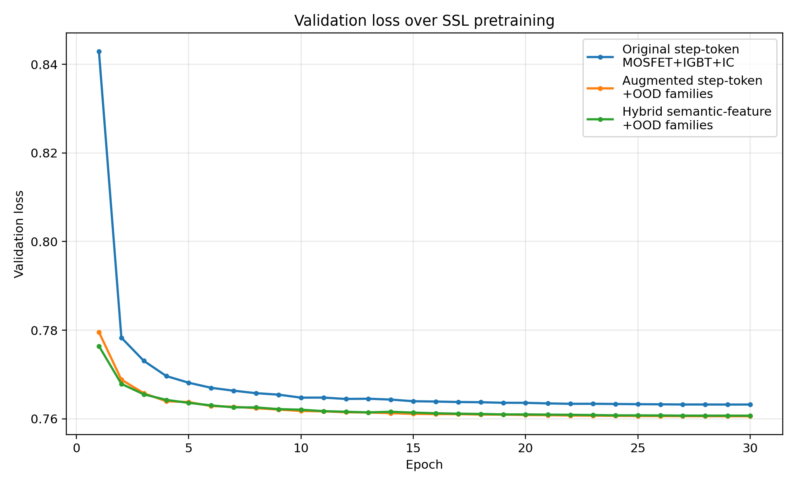 | 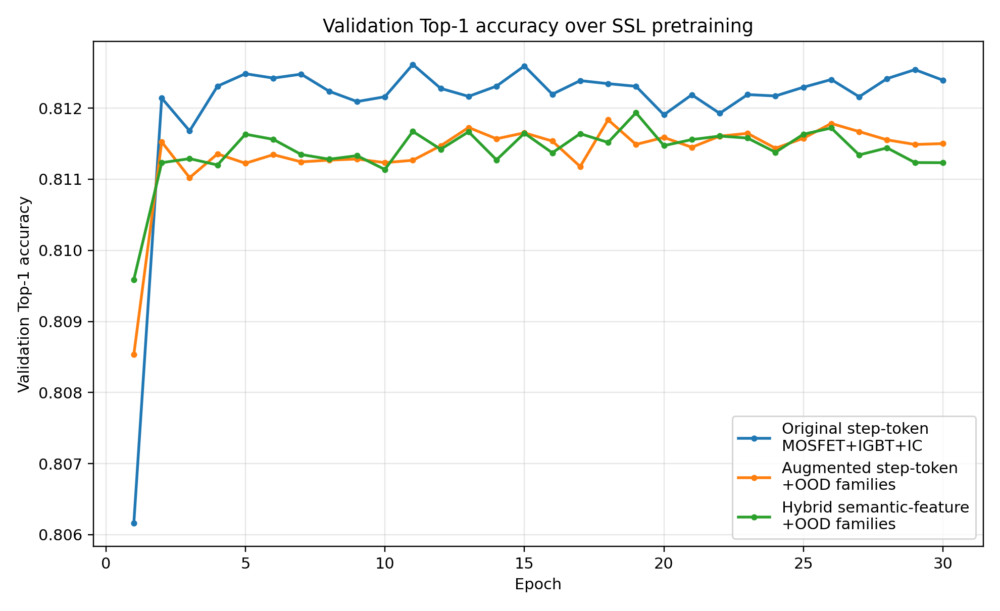 |
| 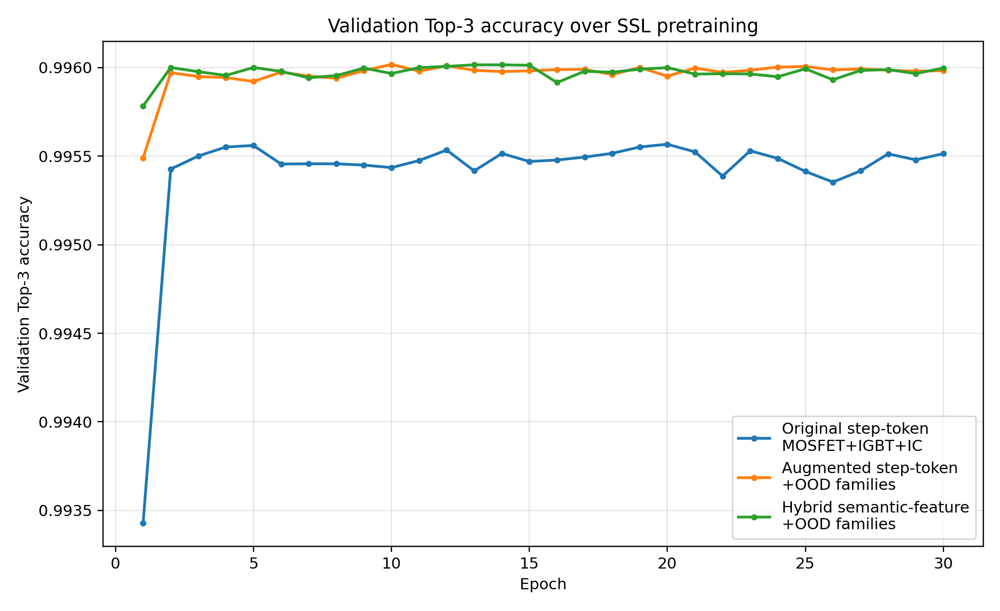 | 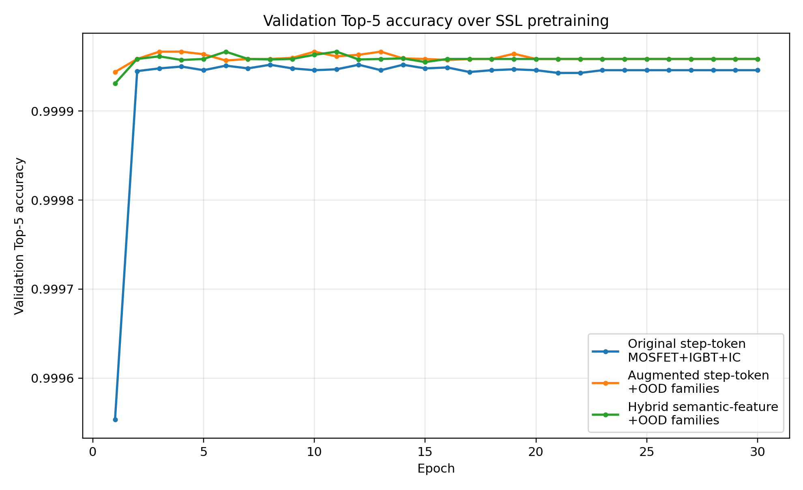 |

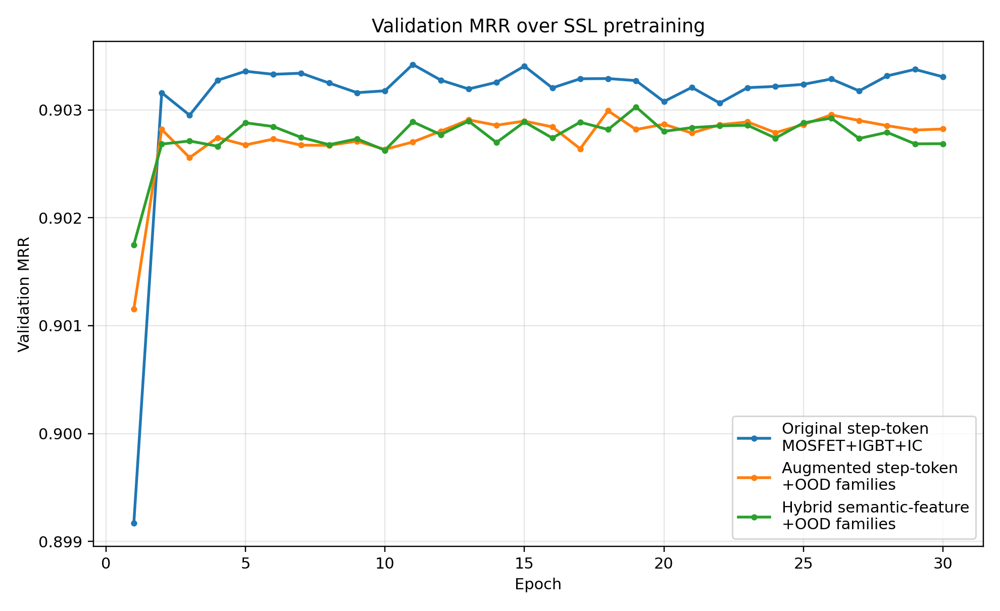

### Final test bar charts

| | |
|---|---|
|  | 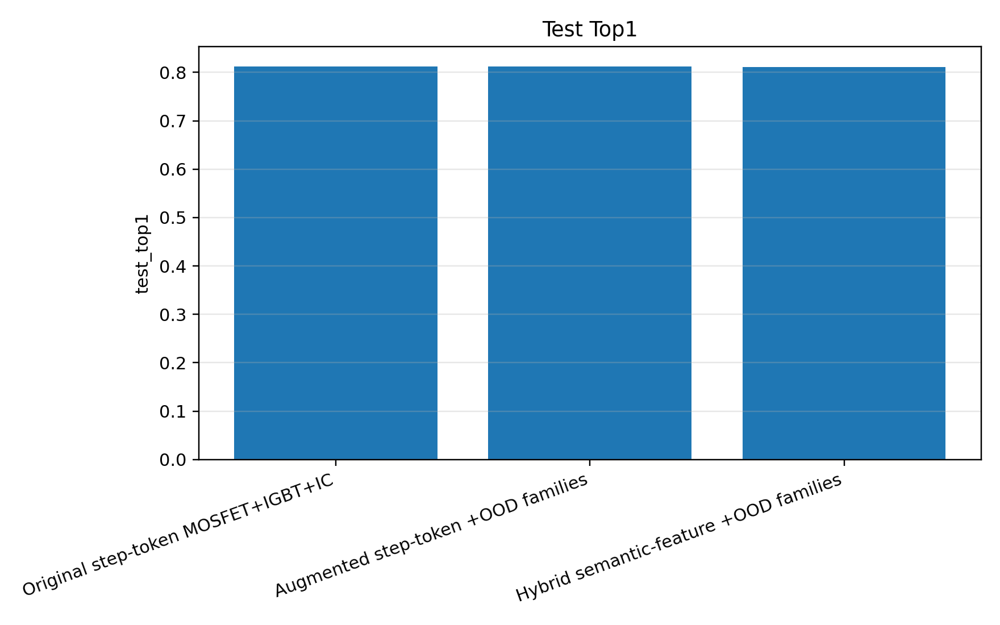 |
| 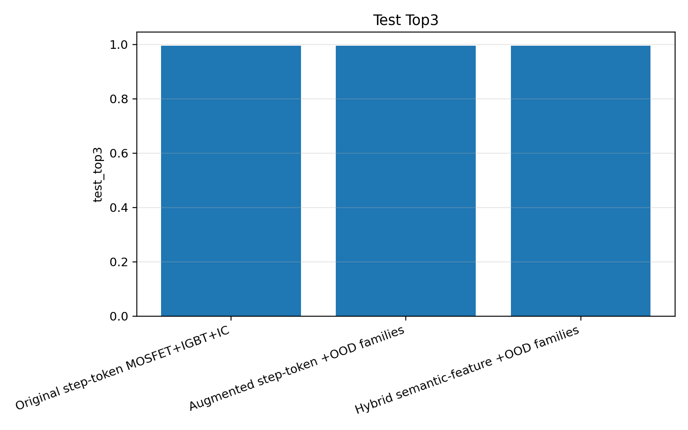 |  |


The bar charts are deliberately near-flat. On in-distribution metrics that *is* the
result: the three configurations are indistinguishable, and a near-flat bar chart is an
honest depiction of "this lever did not move the in-distribution number."

---

## 6. Why the Model Is Small

The headline metrics come from a deliberately small model (parameter count unverified — see §8 Phase 0). Two independent lines of evidence say in-distribution capacity beyond a few million parameters is wasted:

- A 50-line n-gram baseline already reaches very high Top-5 on this generated grammar
  (result not materialized in this repo), which is *why* Top-5 here is saturated — the
  next-step space is tightly constrained by the generator.
- Preliminary scaling runs in this project (4M → 34M → 113M parameters) converge to
  within ~0.0001 LM loss of each other (see `extras/checkpoints/cell*/summary.json`).
  **Caveat:** those runs use the compositional tokenizer (lm_loss ~0.106) rather than
  the step-as-token tokenizer used here (lm_loss ~0.763); no equivalent step-as-token
  scaling sweep exists. The inference that capacity is saturated for the SSL objective
  rests on this proxy.

So the interesting question is never "does a bigger model win on in-distribution?" (it
does not), but "does a small model learn structure that *transfers*?" That this model
saturates Top-5 and reaches ~81% Top-1 makes it a strong, cheap base for the OOD and
anomaly experiments in §8.

---

## 7. Interpretation, Limitations, and Weak Spots

**What we can claim.**
- All three models reach strong, near-saturated in-distribution next-step prediction
  (Top-5 ≈ 1.0; Top-1 ≈ 0.81).
- Widening the training distribution to twice as many families does not degrade the
  core objective, even under a broader test set.
- Compositional semantic features integrate cleanly but are inert on in-distribution prediction (Run 2→3 delta: loss 0.7606→0.7607, Top-1 0.8117→0.8116).

**What we cannot yet claim (and the current report should not imply).**
- **No OOD evidence.** Every metric here is in-distribution. The central motivation —
  that broader pretraining and compositional features improve *generalization* — is
  untested. The "feature embeddings help" hypothesis has neither support nor refutation
  from these numbers.
- **Confounded cross-model comparison.** As flagged in §3, Run 1 and Runs 2/3 use
  different test populations. The clean ablation has not been run.
- **Single seed, no variance.** The inter-model gaps (e.g. 0.7631 vs 0.7606 loss) are
  within plausible run-to-run noise. We report no error bars and should not call any
  configuration a "winner" on these numbers.
- **Synthetic data only.** Results reflect a generated grammar, not real fab routes.
  Saturation is partly an artifact of how constrained the generator is; real process
  logs would likely show more entropy and a lower in-distribution ceiling.
- **Metric saturation hides quality differences.** Because Top-5 is at the ceiling, it
  cannot rank these models. Top-1 and (future) completion / anomaly metrics carry the
  signal.
- **Silent sequence truncation.** Sequences exceeding 192 tokens are right-truncated
  (`ProcessDataset.__getitem__`); the final steps may be dropped for the longest
  SiC MOSFET variants. Verify the truncation rate in Phase 0 by checking max sequence
  length in the data files.

---

## 8. Next-Step Plan (Executable Runbook)

Three evaluations close the open gaps: (1) a confound-free ablation on the original 3-family test set (Phase 2), (2) zero-shot OOD transfer to test the generalization hypothesis (Phase 3), and (3) NLL-based anomaly scoring (Phase 4). A dedicated eval entry point is required first (Phase 1) because the SSL checkpoint format is incompatible with `src/eval/run_eval.py`. Phase 0 materializes the weights and measures the true parameter count.

<details>
<summary>Implementation runbook (Phases 0–5)</summary>

The §3 caveat and the §7 "no OOD evidence" gap are both closed by the same set of
evaluations. Two facts about these checkpoints shape every step below and are the
reason a naive "just run the eval harness" plan does **not** work:

- **These three runs are a self-contained lineage.** They were produced by
  `tracks/industrial-infineon/scripts/train_ssl_hybrid_process_transformer.py`
  (`HybridProcessTransformerLM`), *not* by the `src/` training pipeline.
- **`src/eval/run_eval.py` cannot load these checkpoints.** That harness expects
  `cfg["arch"]`, `cfg["tokenization"]`, `cfg["loss"]` and a model whose `forward`
  returns `{"lm_logits": …}`. The SSL checkpoint stores a *flat* dataclass config
  (`d_model`, `layers`, …) and its `forward(input_ids, feature_ids, family_ids)`
  returns a bare tensor. The first crash is `KeyError: 'tokenization'` at
  `predict.py:43`; the second is `TypeError` at `predict.py:82` because `forward()`
  returns a bare tensor, not `{"lm_logits": …}`. Both must be resolved in Phase 1.
  Do **not** route these checkpoints through `scripts/slurm/eval.sbatch`.

Dependency order: **P0 → P1 → (P2 ∥ P3 ∥ P4) → P5.** P4 (NLL anomaly scoring) only requires the eval entry point from P1 and can run in parallel with P2 and P3. P1 is the linchpin; P2 and P3
are independent slices once it exists.

### Phase 0 — Materialize checkpoints + data, verify the param count

*Goal:* get the weights and the exact training data onto disk; replace the unverified
"~4M" claim with the measured number.

- **Pull weights:** `bash scripts/leonardo/deploy.sh pull` (full rsync including `.pt`;
  `pull-light` deliberately omits them). Confirm each run dir has `checkpoint_best.pt`
  and `vocab.json`.
- **Measure params, don't guess.** For each `checkpoint_best.pt`, load it and compute
  `sum(p.numel() for p in model.parameters())`. The "~4M" figure in this report is
  inherited from the scaling grid's `cell0` (4 layers, 4.24M) — a *different model*.
  The SSL runs default to **6 layers + family/position/6×feature embeddings** and are
  almost certainly larger. **Record the true count and correct the TL;DR and §1.**
- **Regenerate the exact data files,** with pinned seeds, so the held-out split is
  byte-identical to what each run saw:
  - 3-family base via `build_augmented_data.py --seed <S>` (default S=123).
  - 6-family via `generate_ood_families.py --seed <S> --count-per-family <N>`
    (default S=777; per-family seeds are S, S+1000, S+2000 for DIODE, SCHOTTKY,
    SIC_MOSFET). These are two separate scripts with different default seeds.
  - **The generation seed and count must match the original runs.** `split_records`
    is deterministic *given identical input*, but `load_sequences` shuffles the full
    record list before the split — so a regenerated CSV with the same rows in a
    different order produces a different test split even with the same seed. Confirm
    both seeds from Slurm logs / shell history before assuming defaults were used.

*Done when:* three `.pt` files present; measured param counts written into the report;
data files regenerated with confirmed seeds.

### Phase 1 — Add the SSL eval-only entry point (linchpin)

*Goal:* load an SSL checkpoint and report per-family Top-1/3/5, MRR, and loss with no
retraining. *Prereq:* P0.

Implementation contract — **reuse the symbols already in the SSL script**
(`HybridProcessTransformerLM`, `ProcessDataset`, `HybridCollator`, `evaluate`,
`feature_dict_for_token`); add a sibling `eval_ssl_process_transformer.py` rather than
modifying the training `main()`:

1. `ckpt = torch.load(path, weights_only=False)`; use `ckpt["config"]` and the **saved**
   `token_to_id`, `family_to_id`, `feature_to_id`, `feature_names`. `id_to_token` is
   **not** stored in the checkpoint — load it from `vocab.json` (present in each run
   dir) or reconstruct as `{v: k for k, v in token_to_id.items()}`. Without it,
   decoding logit indices back to step strings is impossible.
2. **Use the saved vocab maps verbatim. Do NOT call `build_vocabs` on regenerated
   data** — rebuilding can reorder token ids and silently misalign the (weight-tied)
   embedding table. Reconstruct only `token_feature_table` / `unknown_feature_ids` from
   the saved `feature_to_id` plus `feature_dict_for_token`.
3. Rebuild `HybridProcessTransformerLM` from the config dims; `load_state_dict`. Then
   re-tie the LM head: `model.lm_head.weight = model.step_emb.weight`. PyTorch
   `load_state_dict` loads these as independent tensors; without re-tying the output
   projection diverges from the trained weights.
4. `records = load_sequences(data, 0, seed=cfg.seed)` → `split_records(…, seed=cfg.seed)`
   to recover the identical test split.
5. For each family subset, build `ProcessDataset(filtered, saved_token_to_id,
   saved_family_to_id, max_len)` + `HybridCollator(train=False, token_feature_table=…,
   unknown_feature_ids=…)` (use the table reconstructed in step 2 — do **not** call
   `build_vocabs` here) + `evaluate()`.
6. Emit a per-family CSV.

*Done when:* evaluating each run reproduces its aggregate test row to ≤ 1e-3:
- Run 1 (`original_metrics.csv`): loss 0.7631, Top-1 0.8125
- Run 2 (`augmented_metrics.csv`): loss 0.7606, Top-1 0.8117 ← primary gate
- Run 3 (`hybrid_augmented_metrics.csv`): loss 0.7607, Top-1 0.8116

**The Run 2 reproduce-check is the gate** — if it fails, the loader/vocab wiring is
wrong and no new number can be trusted until it passes. Runs 1 and 3 must also pass
before their results are cited.

### Phase 2 — Confound-free augmentation effect (closes §3)

*Goal:* compare Run 1 vs Run 2/3 on the **same 3-family population.** *Prereq:* P1.

- Evaluate Run 2 and Run 3 with family filter `{'MOSFET', 'IGBT', 'IC'}` (uppercase) — one forward pass,
  sliced. All family keys in the saved `family_to_id` are uppercase because `normalize_step()` calls
  `.upper()` at load time; a lowercase filter silently matches nothing. Compare against Run 1's existing
  3-family numbers in `original_metrics.csv`.

*Done when:* a table of Run 1 / Run 2-on-orig3 / Run 3-on-orig3, all on identical
families — the true augmentation effect with the test-population confound removed.
Update §3 and §4 to cite it.

### Phase 3 — OOD transfer (the actual research question)

*Goal:* does broader pretraining / do the semantic features help on unseen families?
*Prereq:* P1.

- **Run 1 on `{'DIODE', 'SCHOTTKY', 'SIC_MOSFET'}`** (uppercase — same reason as Phase 2)
  = zero-shot transfer. **Bake in the caveat:** OOD step strings absent from Run 1's
  vocab map to `<UNK>`, which caps achievable Top-1. Report the UNK-rate of the OOD
  targets under Run 1's vocab next to the accuracy, or the number is misleading.
  Additionally, exclude positions where the gold target is not in Run 1's vocab from the
  Top-1 accuracy computation, or report two numbers: accuracy over all positions and
  accuracy over in-vocab positions only. A `<UNK>`-to-`<UNK>` prediction is not a
  meaningful hit and inflates the OOD Top-1.
- **Run 2 and Run 3 on the same OOD-3 slice** (in-distribution for them).
- The **Run 2 vs Run 3 delta on OOD-3 is the only place the semantic features can show
  value.** If it is flat here too, the honest verdict is "features inert for this data,"
  and the report should say exactly that rather than hedge.

*Done when:* an OOD transfer table with the UNK-rate footnote, in-vocab vs all-positions
accuracy split for Run 1, and an explicit verdict on the feature hypothesis.

### Phase 4 — Anomaly detection (mind the lineage split)

- **NLL proxy — runnable on the SSL model now.** Score valid vs corrupted sequences by
  mean per-token NLL and report separation (AUROC). The SSL model has no validity head,
  so this is the only anomaly signal it can produce directly.
- **Head-based validity + rule attribution belongs to the `src/` multitask model**, not
  these checkpoints. Run it through `src/eval/run_eval.py` with a `src/`-trained
  checkpoint. Do not attempt to load an SSL checkpoint there (it will fail at
  `load_model`).

*Done when:* an NLL-separation number for the SSL model, with a one-line note that
head-based anomaly is a separate model.

### Phase 5 — Variance

- Re-run the three configs at **2–3 seeds** (vary `--seed`; the script seeds both
  `random` and `torch`). Report mean ± range.

*Done when:* error bars on the §3 table and a defensible "winner / no winner" statement —
the sub-0.3pp deltas can finally be called noise or signal with evidence.

</details>

---

## 9. Files in This Folder

Per-run training logs (one row per epoch/split; final `test` row at epoch 30):

```text
original_metrics.csv            # Run 1
augmented_metrics.csv           # Run 2
hybrid_augmented_metrics.csv    # Run 3
```

Cross-run summaries:

```text
ssl_model_comparison_summary.csv   # all three runs, best-val + test metrics
ssl_comparison_summary.csv         # Runs 1 and 2 only
```

Figures:

```text
ssl_val_loss_comparison.png  ssl_val_top1_comparison.png
ssl_val_top3_comparison.png  ssl_val_top5_comparison.png  ssl_val_mrr_comparison.png
test_loss_bar.png  test_top1_bar.png  test_top3_bar.png  test_top5_bar.png  test_mrr_bar.png
```

Earlier two-run comparison plots (Runs 1 and 2 only; superseded by the `ssl_val_*` set above):

```text
val_loss_comparison.png  val_mrr_comparison.png
val_top1_comparison.png  val_top3_comparison.png
```

**Run 3 label mapping.** The run is stored as `ssl_hybrid_augmented_full` in the CSV
`run` column, displayed as `Hybrid semantic-feature augmented` in §3, and listed as
`Hybrid semantic-feature +OOD families` in `ssl_model_comparison_summary.csv`. All
three refer to the same checkpoint.

Plotting scripts (regenerate the figures above from the CSVs):

```text
plot_ssl_comparison.py
plot_ssl_model_comparison.py
```

<!-- BEGIN_COVERAGE_GUIDED_RESULTS -->

---

## Coverage-Guided Data Run

We added a fourth SSL run trained on the new coverage-guided valid semiconductor process dataset.

### Updated Final Test Metrics

| Model | Test loss | Top-1 | Top-3 | Top-5 | MRR |
|---|---:|---:|---:|---:|---:|
| Original step-token | 0.7631 | 0.8125 | 0.9955 | 0.9999 | 0.9034 |
| Augmented step-token | 0.7606 | 0.8117 | 0.9960 | 1.0000 | 0.9029 |
| Hybrid semantic-feature augmented | 0.7607 | 0.8116 | 0.9960 | 1.0000 | 0.9029 |
| Hybrid coverage-guided valid data | 0.7829 | 0.8031 | 0.9932 | 0.9997 | 0.8976 |

### Interpretation

The new coverage-guided run reaches **Top-1 0.8031**, **Top-3 0.9932**, **Top-5 0.9997**, and **MRR 0.8976** on the held-out test split. It remains very strong on in-distribution next-step prediction. Compared with the previous SSL runs, it is slightly lower on exact Top-1/Top-3, which is consistent with the coverage-guided dataset being more diverse and harder, rather than simply larger.

The important conclusion is not that the new run is the absolute winner on in-distribution next-step prediction. The stronger result is that the new data pipeline creates a broader, coverage-guided valid-process benchmark while the hybrid model still reaches near-saturated Top-3/Top-5 performance.

The next meaningful evaluation is no longer plain in-distribution next-step prediction, but:

- anomaly detection on easy and hard invalid sequences,
- rule-violation attribution,
- OOD or held-out-branch generalization,
- error-driven regeneration around model failure modes.

### New Figures

Validation curves:

| | |
|---|---|
| 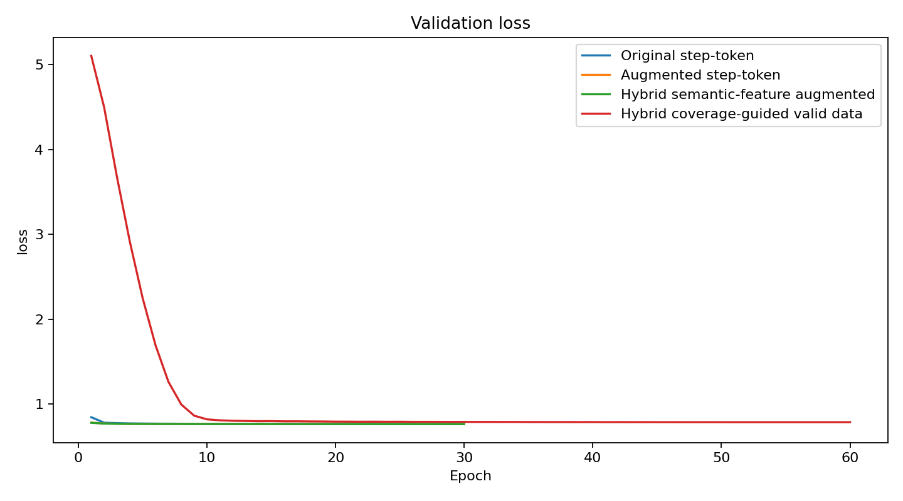 |  |
| 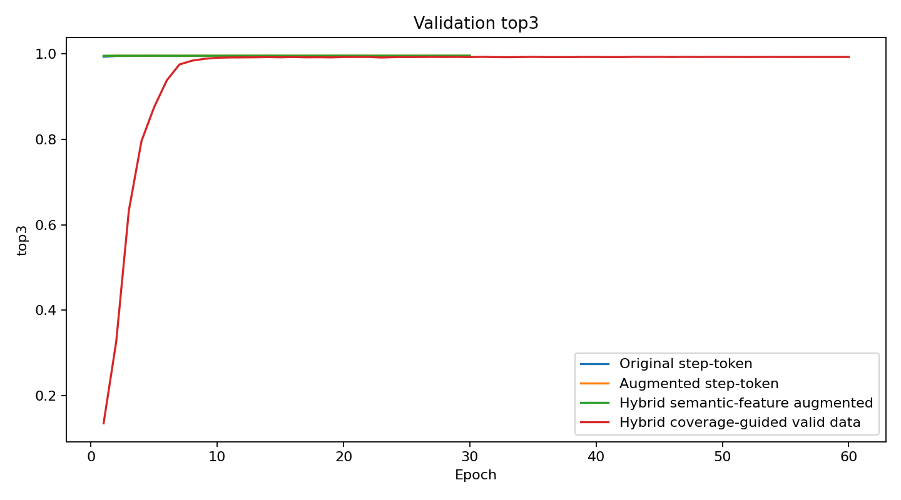 | 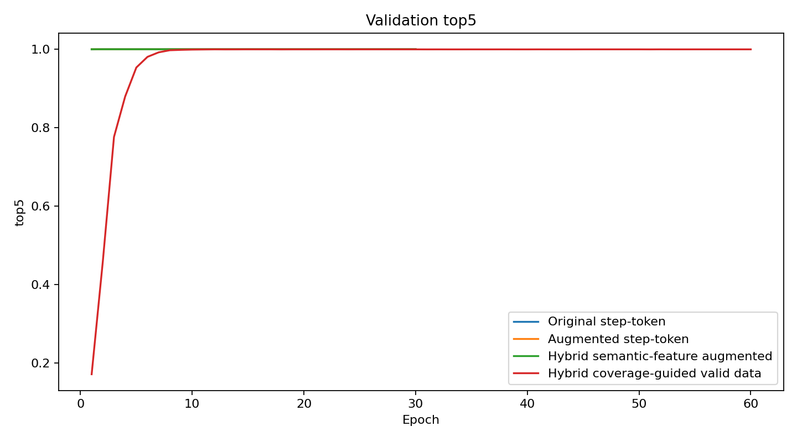 |

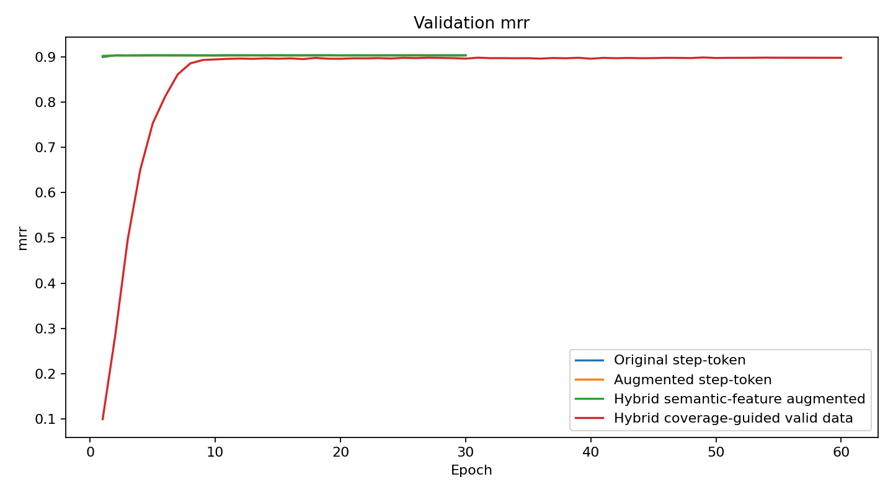

Final test bar charts:

| | |
|---|---|
| 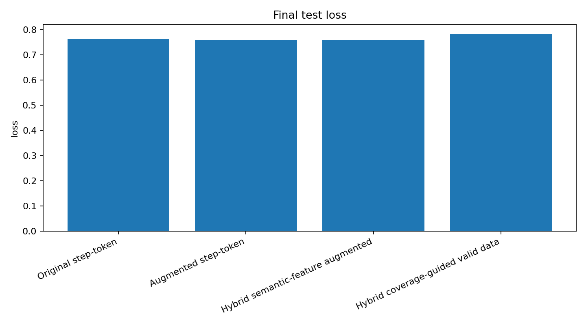 | 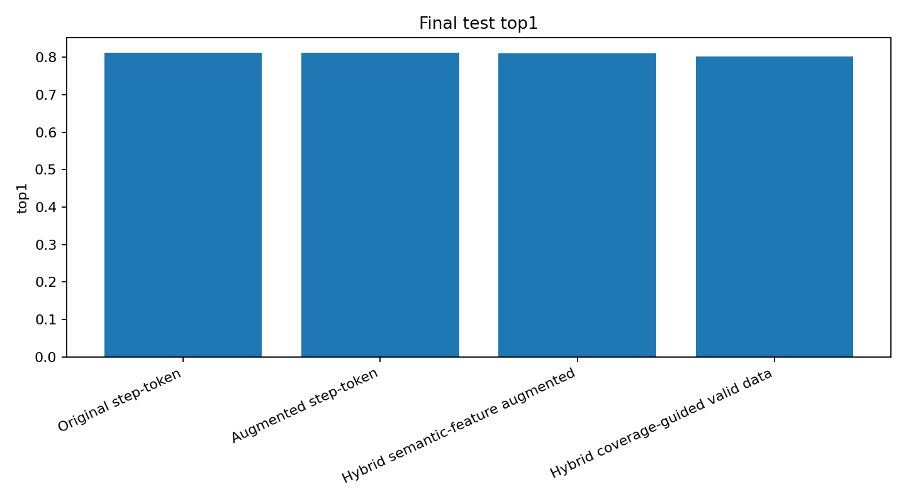 |
| 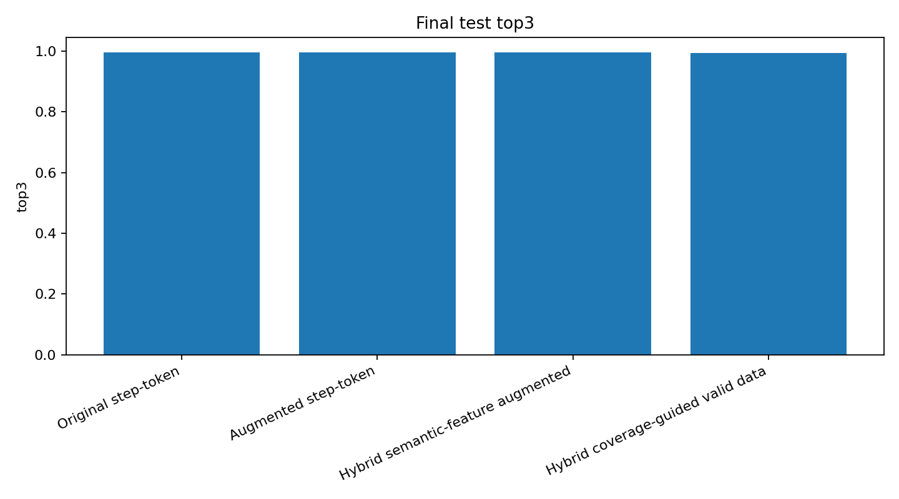 |  |

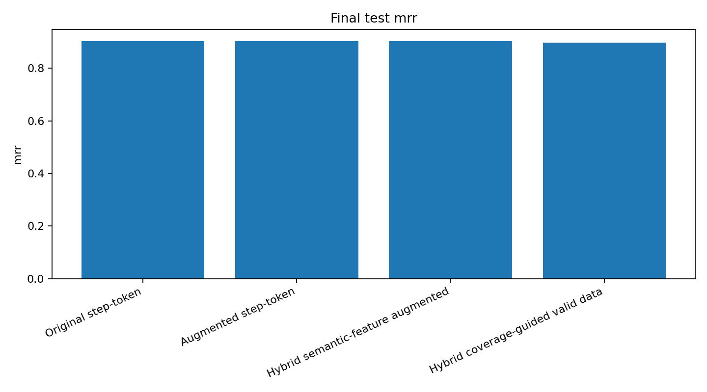

<!-- END_COVERAGE_GUIDED_RESULTS -->
