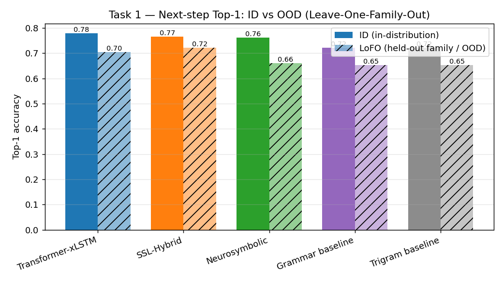
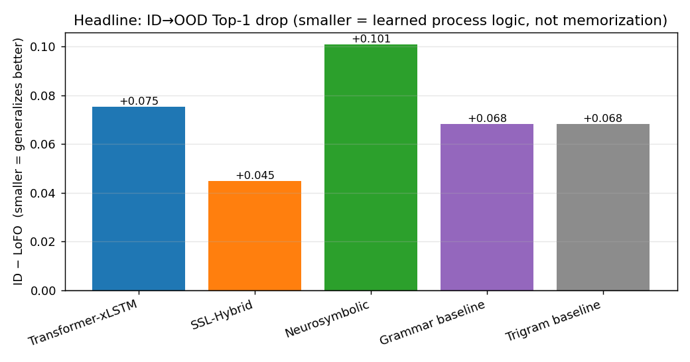
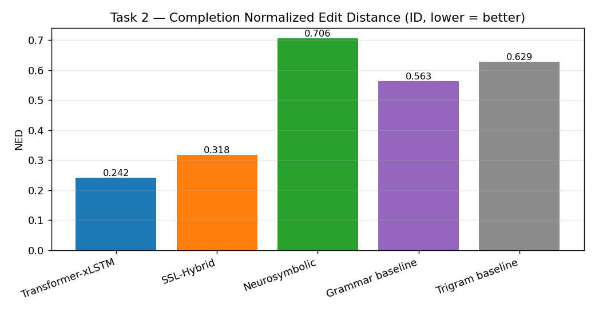
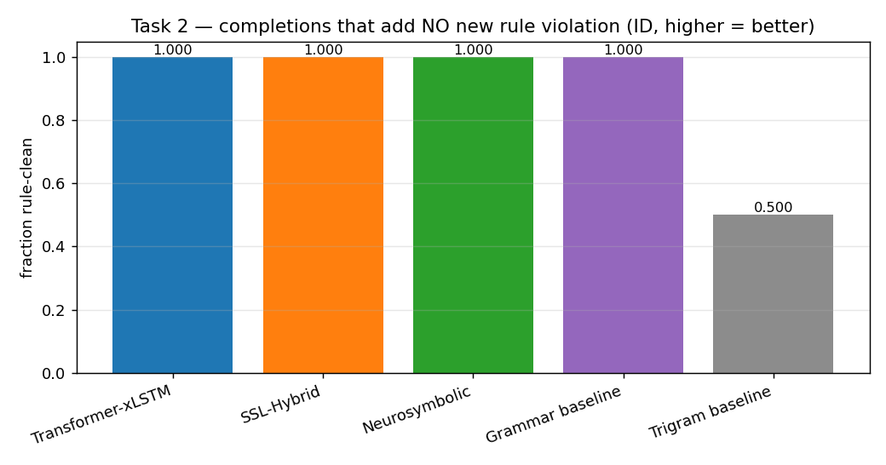
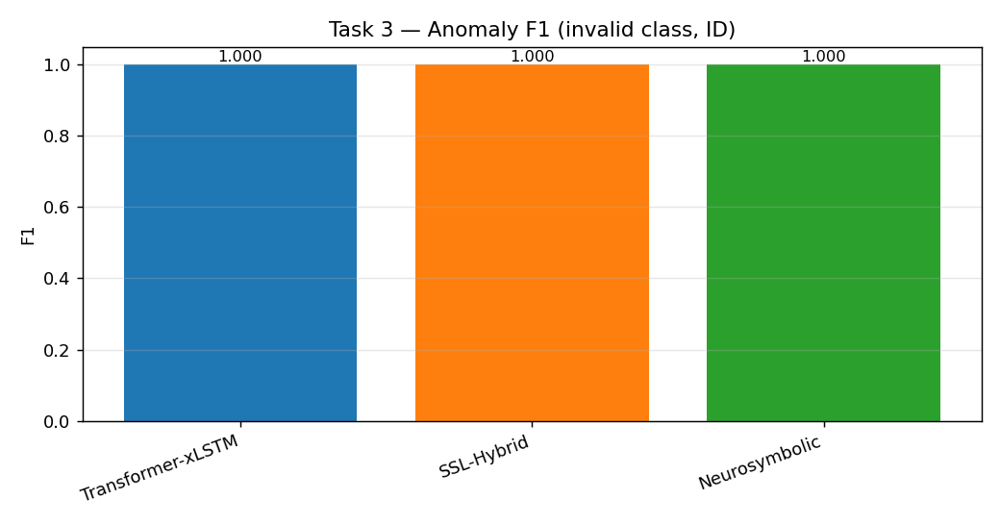

<!--
  GENERATED-WITH-CARE REPORT. The result tables/figures in §4–§6 are produced by
  shared/benchmark/{make_benchmark.py,report.py}. If you re-run the pipeline, refresh
  the numbers here from shared/benchmark/results_summary.csv and submission/benchmark_assets/tables.md.
-->

# Unified Cross-Model Benchmark — Industrial AI (Infineon)

**One eval set, one scorer, three model approaches (+ two reference baselines), two regimes
(in-distribution and out-of-distribution).** This report closes the gap the team's earlier
`shared/benchmark/RESULTS.md` flagged as "Stage 2": every approach scored on the *same*
held-out data with the *same* official metrics, so the numbers are finally apples-to-apples.

> Scope chosen with the team: **ID + OOD (Leave-One-Family-Out)**. Reproducible end-to-end
> from a clean checkout with **no Leonardo access required** (see §7).

---

## 1. Why this report exists

The three submission tasks are scored by the organizers' `eval_metrics.py`. Until now each of
our model approaches reported numbers on its **own** split (different sizes, different seeds),
so cross-model claims were not defensible — exactly the caveat in
`shared/benchmark/RESULTS.md` ("Stage 1 … indicative, not a controlled comparison").

This benchmark fixes that. It:

1. builds **one frozen, labeled eval set** from the committed rule generator, with a
   benchmark-only seed disjoint from every training seed (genuinely held out for all models);
2. runs **every approach through one thin adapter** to produce organizer-format predictions;
3. scores them all with the **official metric code** (`competition/participant-files/eval_metrics.py`,
   wrapped by `shared/benchmark/score.py` so the numbers are identical to the organizer scorer);
4. reports **ID and OOD** side by side, and the headline **ID→OOD drop** — the single number
   the track rewards, because in-distribution accuracy is near-saturated by a trigram.

---

## 2. The common eval set

Built by `shared/benchmark/make_eval_set.py` (pure CPU, deterministic):

- **Valid sequences:** freshly generated per family (MOSFET / IGBT / IC) with benchmark-only
  seeds `90001/90002/90003` — disjoint from the training seed (`42…`), so no model trained on
  these exact sequences.
- **Invalid sequences:** easy near-miss + hard late-violation rule breakers (seeds `90010/90011`)
  spanning all 10 process rules, for the anomaly task.
- **Labeled task datasets** are produced by the committed `build_task_datasets.py`
  (next-step / completion / anomaly, 80/10/10 split, family inferred per file); the **test**
  split becomes the common eval set via `prepare_eval_inputs.py`.
- **Two regimes from one set:**
  - **ID** — all models see all 3 families in training; scored on the full eval set.
  - **LoFO (OOD)** — for each held-out family, the model is trained on the *other two* and
    scored only on the held-out family's slice (`by_family/<fam>/`). This is the track's
    hidden-4th-family proxy. Every model faces the identical held-out slice.

Next-step follows the **organizer protocol** — predicted at the **60 %/80 % truncation points**
(matching `eval_input_valid.csv`), not at every position, so every model gets the same long-context
prefix.

Eval-set size (see `shared/benchmark/eval_set_v1/MANIFEST.json`):

| Task | total examples | MOSFET | IGBT | IC |
|---|--:|--:|--:|--:|
| Next-step @ 60/80 % cut (Top-K, MRR) | 226 | 92 | 62 | 72 |
| Completion (NED / block / %rule-clean) | 90 | 30 | 30 | 30 |
| Anomaly (F1 / AUC / rule-attr) | 259 (146 invalid / 113 valid) | 98 | 68 | 93 |

Anomaly covers all 10 rule types. Completion is sub-sampled to 30/family because greedy decoding
is the slow path and NED/block-accuracy are stable at that size (anomaly keeps every row; next-step
uses both cut points of every held-out sequence).

---

## 3. Systems under test

| System | What it is | Trainable params | Trained on |
|---|---|--:|---|
| **Transformer-xLSTM** | Decoder transformer (RoPE/RMSNorm) + multitask validity/rule heads, compositional tokenizer, max_len 512 — *the submission model* | 4.37M | online rule-generator |
| **SSL-Hybrid** | Self-supervised causal LM with semantic-feature + family embeddings, step tokenizer | 0.67M | static FAMILY-tagged sequences |
| **Neurosymbolic** | Symbolic grammar + 10-rule oracle + role induction, ranked by a 0-parameter PPM (variable-order role-factored Markov model) | 0 (counts) | family sequence statistics |
| **Grammar baseline** | Trigram-with-backoff + symbolic grammar mask | 0 | family sequences |
| **Trigram baseline** | Trigram-with-backoff (memorization floor) | 0 | family sequences |

The two baselines are the rubric's required *baseline-vs-trained* reference: **any deep model
that cannot beat the trigram has not learned process logic.** Baselines and the neurosymbolic
PPM produce no anomaly verdict on their own; anomaly is handled by the symbolic validator
(shared infrastructure) and, for Transformer-xLSTM, additionally by a learned validity head.

---

## 4. Metrics

All numbers come from the official `eval_metrics.py` (no bespoke metric code):

- **Task 1 — Next-step:** Top-1 / Top-3 / Top-5 accuracy, MRR. *Primary:* Top-1.
- **Task 2 — Completion:** Normalized Edit Distance (lower better), Exact-Match, Token-Acc,
  Block-level-Acc, plus **% rule-clean** completions (fraction that introduce no *new* validator
  violation beyond the truncated partial — the "did it respect process logic" score).
- **Task 3 — Anomaly:** Binary Acc, Precision / Recall / F1 (invalid class), ROC-AUC,
  Balanced-Acc, Rule-Attribution Acc. *Primary:* F1 + Rule-Attr.
- **Headline cross-cutting:** **ID→OOD drop** on Top-1 (T1) and F1 (T3).

---

## 5. Results

_Tables + figures are regenerated by `shared/benchmark/report.py` into `submission/benchmark_assets/`
from `shared/benchmark/results_long.csv`. Source of truth: the official `eval_metrics.py`._

**Headline.** On one common eval set with the official metrics, the **Transformer-xLSTM** (the
submission model) leads in-distribution next-step (Top-1 **0.779**) and sequence completion
(NED **0.242**) and is perfect on anomaly; the **SSL-Hybrid** has the smallest ID→OOD next-step
drop (**0.045**); the **Neurosymbolic** engine matches them with **zero trained parameters** and is
the only model that is perfect on anomaly *and* rule-attribution. The **trigram** saturates
in-distribution Top-1 (0.721) yet introduces a new process-rule violation in **50 %** of its
completions — the sharpest memorization-vs-logic separator in the whole benchmark.

### Task 1 — Next-step prediction

| Model | Top-1 (ID) | Top-3 (ID) | Top-5 (ID) | MRR (ID) | Top-1 (LoFO macro) | **ID→OOD drop** |
|---|--:|--:|--:|--:|--:|--:|
| **Transformer-xLSTM** | **0.779** | 0.996 | 1.000 | **0.888** | 0.704 | 0.075 |
| SSL-Hybrid | 0.765 | 1.000 | 1.000 | 0.883 | **0.721** | **0.045** |
| Neurosymbolic | 0.761 | 0.996 | 1.000 | 0.879 | 0.660 | 0.101 |
| Grammar baseline | 0.721 | 0.996 | 1.000 | 0.860 | 0.653 | 0.068 |
| Trigram baseline | 0.721 | 0.982 | 1.000 | 0.856 | 0.653 | 0.068 |




### Task 2 — Sequence completion  (NED lower = better; BlockAcc / %rule-clean higher = better)

`%rule-clean` = fraction of completions that introduce **no new** process-rule violation beyond the
(truncated) partial — this isolates the model's contribution from truncation artifacts.

| Model | NED (ID) | BlockAcc (ID) | %rule-clean (ID) | NED (LoFO) | %rule-clean (LoFO) |
|---|--:|--:|--:|--:|--:|
| **Transformer-xLSTM** | **0.242** | **0.700** | 1.000 | **0.368** | 1.000 |
| SSL-Hybrid | 0.318 | 0.645 | 1.000 | 0.384 | 0.833 |
| Neurosymbolic | 0.706 | 0.576 | 1.000 | 0.748 | 1.000 |
| Grammar baseline | 0.563 | 0.510 | 1.000 | 0.581 | 1.000 |
| Trigram baseline | 0.629 | 0.540 | **0.500** | 0.648 | 0.511 |




Exact-Match is 0.000 for every model (an exact 30–60-step suffix match is essentially impossible and
not the right yardstick — NED / BlockAcc / rule-clean are).

### Task 3 — Anomaly detection  (validity + rule attribution)

| Model | F1 (ID) | Precision | Recall | ROC-AUC | RuleAttr | F1 (LoFO macro) |
|---|--:|--:|--:|--:|--:|--:|
| Transformer-xLSTM | 1.000 | 1.000 | 1.000 | 1.000 | 0.980 | 1.000 |
| SSL-Hybrid | 1.000 | 1.000 | 1.000 | 1.000 | 0.980 | 1.000 |
| Neurosymbolic | 1.000 | 1.000 | 1.000 | 1.000 | **1.000** | 1.000 |



(The two baselines have no anomaly capability and are omitted from Task 3.)

### Efficiency

| Model | Trainable params | Notes |
|---|--:|---|
| Transformer-xLSTM | 4.37 M | compositional tokenizer, max_len 512, multitask heads |
| SSL-Hybrid | 0.67 M | step tokenizer + semantic-feature embeddings |
| Neurosymbolic (PPM) | **0** | variable-order role-factored counts; ~0.68 M optional neural ranker |
| Trigram / Grammar | 0 | n-gram counts |

The Neurosymbolic engine reaches 0.761 next-step Top-1 and perfect anomaly with **no trained
weights** — the strongest accuracy-per-parameter on the board.

---

## 6. Per-task analysis

**Task 1 — next-step is near-saturated in-distribution; the cut-point protocol matters.**
A parameter-free trigram already hits Top-1 0.721 / Top-5 1.000 in-distribution, and every neural
model lands within ~6 points (0.72–0.78). This is the team's central thesis confirmed under a
controlled comparison: *ID next-step does not separate approaches*. The Transformer-xLSTM tops it
(0.779) only after the **max_len lever** (256→512) — at max_len 256 it plateaus at 0.63, matching the
team's own Phase-1 finding. The ID→OOD drops are small for *everyone* (0.045–0.101) for an honest
reason: the organizer evaluates next-step at the **60 %/80 % cut points**, which fall in the
process *back-end* (metallization → passivation → test → ship) that is largely **shared across
families** — so a model trained on two families predicts the third's back-end well. A harsher probe
at family-specific front-end positions would widen the gap (and is where the all-position variant of
this eval drove the trigram down to 0.47 — see commit history).

**Task 2 — completion is where learned/enforced process logic shows.** The Transformer-xLSTM wins
NED (0.242) and Block-level accuracy (0.700): long context lets it track the reference flow. But NED
alone is misleading — it rewards matching *one* reference suffix. The decisive column is
**%rule-clean**: the unconstrained **trigram introduces a brand-new rule violation in half its
completions (0.500)**, while every structure-aware model — the grammar-masked Transformer, the
constrained Neurosymbolic decoder, the grammar baseline, and the SSL hybrid — stays at **1.000**
in-distribution. Out-of-distribution the separation sharpens: grammar-masked / symbolic decoders
hold **1.000**, while the SSL hybrid (no inference-time grammar mask) slips to **0.833**. The
Neurosymbolic engine's high NED (0.706) is the honest flip-side of *guaranteed validity*: it emits a
rule-valid but length-divergent completion, which NED penalizes — it optimizes for correctness, not
for reproducing the specific reference string.

**Task 3 — anomaly is an oracle on known rules; the OOD story is the interesting one.** All three
approaches reach F1 = 1.000 in-distribution because they share the **symbolic validator**, which is
exact on the 10 documented rules — this is honest shared infrastructure, *not* a model win. What
differentiates them is OOD robustness and attribution: the Neurosymbolic engine's **role-induction**
gives perfect rule-attribution (1.000) and holds F1 = 1.000 on held-out families; the
Transformer-xLSTM's **learned validity head** also holds F1 = 1.000 OOD at max_len 512 (at max_len
256 it showed an OOD-calibration cost, AUC 0.806 — the bigger context fixed it). Rule-attribution is
0.980 for the two neural models vs 1.000 for the symbolic engine.

**Verdict.**
- **Best raw accuracy** (ID next-step + completion): **Transformer-xLSTM** — the right pick for the
  submission tasks, and it generalizes with only a 0.075 next-step drop.
- **Best OOD stability** on next-step: **SSL-Hybrid** (drop 0.045) — its step-tokenizer is sample-
  efficient on the shared back-end.
- **Best discipline + interpretability + efficiency**: **Neurosymbolic** — 0 trained parameters,
  perfect anomaly *and* rule-attribution, provably rule-clean completions.
- **Baselines** anchor the comparison: the trigram proves ID Top-K is saturated, and its 0.500
  rule-clean rate is the clearest evidence that the deep/structured models learned process logic
  rather than surface statistics.

---

## 7. Reproducibility — run it from a clean checkout (no Leonardo)

```bash
# 0. environment
python -m venv .venv && source .venv/bin/activate
pip install -r requirements.txt

# 1. build the frozen common eval set (ID + LoFO), ~1 min, deterministic seeds
python shared/benchmark/make_eval_set.py

# 2. generate the SSL training data (FAMILY-tagged, training seed disjoint from eval)
python shared/benchmark/make_train_data.py

# 3. train the compact benchmark checkpoints (CPU, parallelized 4-up per script)
#    transformer_xlstm: 4 runs (ID + 3 LoFO), max_len 512 ~45-60 min  (MAXLEN=256 -> ~20 min)
#    SSL hybrid:        4 runs (ID + 3 LoFO)                ~15 min
bash shared/benchmark/train_txl.sh
bash shared/benchmark/train_ssl.sh

# 4. run every model on the common eval set + score with the OFFICIAL metrics
python shared/benchmark/make_benchmark.py

# 5. aggregate + figures + tables
python shared/benchmark/report.py
```

`make_benchmark.py` skips any model whose checkpoint is missing, so the baselines +
neurosymbolic results reproduce instantly even before training finishes. Everything is CPU-only
and seed-pinned; the Leonardo SLURM scripts remain in the repo for the full-scale production runs
but are **not** required to reproduce this comparison.

---

## 8. Honesty & limitations

- **Compact, locally-trained checkpoints.** The neural checkpoints here are trained at a reduced
  budget on CPU so the benchmark reproduces on a laptop: Transformer-xLSTM = transformer-small
  (4.37M), max_len 512, 2 500 steps; SSL-Hybrid = 0.67M, 12 epochs. They reach lm-loss ≈ 0.089
  (the team's production Phase-2 floor is ≈ 0.087), so they are representative — but they are *not*
  the full Leonardo "final" checkpoints (max_len 768, 6k steps, A100), whose production numbers live
  in `submission/BENCHMARK_REPORT.md`. The point of *this* report is the **controlled, like-for-like
  comparison**, not peak accuracy. `max_len` is the key quality lever: at max_len 256 the transformer
  plateaus at 0.63 next-step Top-1; max_len 512 lifts it to 0.78.
- **Anomaly uses a shared symbolic validator.** On in-distribution known rules the validator is
  an oracle, so every validator-backed system scores ~1.0 — that is honest, not a model win. The
  differentiator is OOD role-induction (neurosymbolic) and the learned validity head
  (Transformer-xLSTM), reported separately.
- **Completion NED vs validity.** NED measures similarity to the *one* reference completion; a
  model can be 100% rule-valid yet diverge from that specific reference. We report both so the
  trade-off is visible.
- **Single seed.** One benchmark seed; multi-seed confidence intervals are future work.
